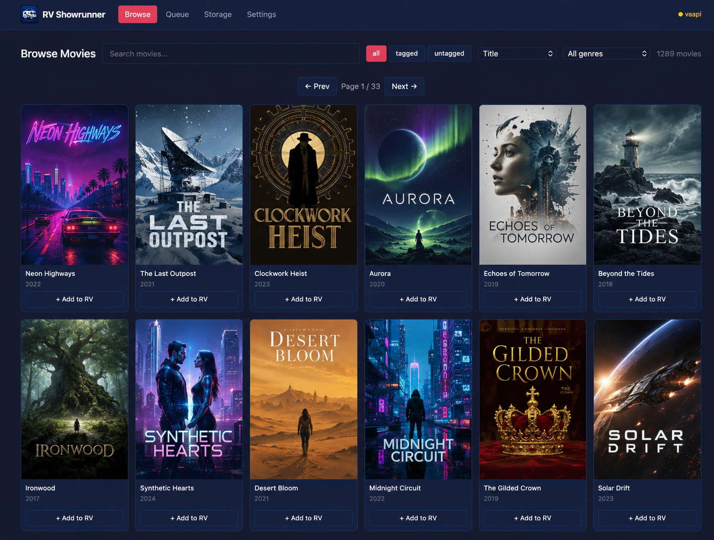
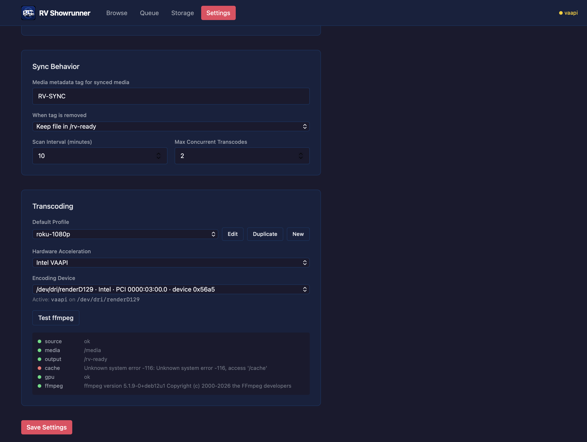

# rv-showrunner

[](https://github.com/lowgatelabs/rv-showrunner/actions/workflows/publish.yml)
[](https://github.com/lowgatelabs/rv-showrunner/releases)
[](LICENSE)
[](https://ghcr.io/lowgatelabs/rv-showrunner)

rv-showrunner prepares media for a disconnected mobile media server. It is built for setups like an RV, camper, boat, cabin, or any other place where you want your media library to keep working when internet access is slow, metered, or unavailable.

The app connects to Jellyfin or Plex, watches for media tagged for RV sync, transcodes those files into a smaller device-friendly format, and writes the finished files to an output folder that can be synced to a mobile server with Syncthing.

## What It Does

- Scans Jellyfin or Plex for movies tagged or labeled with a configurable value, default `RV-SYNC`.
- Transcodes selected media into an RV-ready output profile, default `roku-1080p`.
- Writes completed files to `/rv-ready` for pickup by Syncthing.
- Keeps source media mounted read-only.
- Uses `/cache` as a working directory for in-progress transcodes.
- Supports Intel VAAPI hardware acceleration via `/dev/dri`.
- Provides a web UI for queue status, settings, storage, logs, and diagnostics.

## Screenshots


*Browse your Jellyfin or Plex library, filter by tagged/untagged, and queue movies for the RV with one click.*


*Configure sync behavior, transcode profiles, and hardware acceleration — all from the web UI.*

## Intended RV (or other vehicle) Setup

rv-showrunner is intended to be one part of a larger disconnected media setup in your RV, boat, car, Gulfstream, submarine, or anywhere you might want to watch a movie without reliable fast connectivity:

1. A home media server running Jellyfin or Plex with access to your main media library.
2. rv-showrunner running near that library, usually on the same Docker host or Unraid server.
3. Syncthing syncing rv-showrunner's finished `/rv-ready` output to a mobile device.
4. A mobile Jellyfin server, recommended on a Raspberry Pi or similar low-power computer with appropriate storage (an old SSD or USB drive works well here).
5. A travel router, such as a GL.iNet router, configured as the RV network wirless network.
6. A tv in your RV (obvi). I use a Roku TV with the native Jellyfin app, but you could connect a "dumb" tv directly to your Pi for media playback.

With a router that supports multiple WiFi WAN connections, the RV will connect to your home WiFi while parked in the driveway. Syncthing will then copy newly prepared media onto the mobile server automatically. Once you leave, the RV media server keeps running locally without internet access.

This creates a "sync in the driveway, watch offline on the road" workflow that all runs automatically once properly setup.

## Requirements

- Docker or Unraid.
- A Jellyfin or Plex server for the source library.
- A Jellyfin API key or Plex token.
- Source media available to the container.
- An output folder for RV-ready media.
- Enough cache space for active transcodes.
- Optional but recommended: Intel Quick Sync / VAAPI support exposed through `/dev/dri`.

## Docker Install

Replace paths with locations from your host. The source media mount should match the path your selected media server reports for files through `JELLYFIN_MEDIA_PATH` or `PLEX_MEDIA_PATH`.

```yaml
services:
  rv-showrunner:
    image: ghcr.io/lowgatelabs/rv-showrunner:latest
    container_name: rv-showrunner
    restart: unless-stopped
    ports:
      - "3000:3000"
    volumes:
      - /mnt/user/appdata/rv-showrunner:/config
      - /mnt/user/Media:/media:ro
      - /mnt/user/rv-ready:/rv-ready
      - /mnt/cache/rv-showrunner:/cache
    devices:
      - /dev/dri:/dev/dri
    environment:
      - MEDIA_SOURCE=jellyfin
      - JELLYFIN_URL=http://jellyfin:8096
      - JELLYFIN_API_KEY=your_api_key_here
      - JELLYFIN_MEDIA_PATH=/mnt/user/Media
      - PLEX_URL=http://plex:32400
      - PLEX_TOKEN=your_plex_token_here
      - PLEX_MEDIA_PATH=/mnt/user/Media
      - RV_TAG=RV-SYNC
      - SOURCE_MEDIA_ROOT=/media
      - OUTPUT_ROOT=/rv-ready
      - CACHE_ROOT=/cache
      - CONFIG_ROOT=/config
      - TRANSCODE_PROFILE=roku-1080p
      - HW_ACCEL=vaapi
      - SCAN_INTERVAL_MINUTES=10
      - MAX_CONCURRENT_TRANSCODES=1
    group_add:
      - "video"
      - "render"
```

Start it:

```bash
docker compose up -d
```

Then open:

```text
http://your-server-ip:3000
```

Use `:edge` instead of `:latest` to track the latest development build from the `main` branch. WARNING: this build is not fully tested and will possibly/probably be broken at some point!

## Unraid Community Applications Install

1. Open Unraid's **Apps** tab.
2. Search for `rv-showrunner`.
3. Install the container from Community Applications.
4. Set the required paths:
   - **Config**: persistent app config, database, logs, and profiles.
   - **Media**: read-only mount for your source media.
   - **RV Ready Output**: completed files for Syncthing.
   - **Cache / Working Dir**: temporary working space for transcodes.
5. Choose one active source, Jellyfin or Plex, and set its connection values (or enter these later in the web interface once rv-showrunner is up and running):
   - **Media Source**
   - **Jellyfin URL**, **Jellyfin API Key**, and **Jellyfin Media Path**
   - or **Plex URL**, **Plex Token**, and **Plex Media Path**
   - **RV Tag**, default `RV-SYNC`
6. If using Intel hardware acceleration, pass through `/dev/dri` and keep `HW_ACCEL=vaapi`.
7. Start the container and open the web UI from the Unraid Docker page.

The Unraid template expects source media at `/media`, output at `/rv-ready`, cache at `/cache`, and config at `/config` inside the container.

## Media Source Setup

Set `MEDIA_SOURCE` to `jellyfin` or `plex`, or choose the active source from Settings.

For Jellyfin, create an API key from the Jellyfin admin dashboard and provide it as `JELLYFIN_API_KEY`.

For Plex, provide the Plex Media Server URL and a token with access to the source library as `PLEX_URL` and `PLEX_TOKEN`.

Tag or label media that should be prepared for the RV with the configured value, default:

```text
RV-SYNC
```

rv-showrunner scans the selected source on a timer, finds tagged or labeled items, and queues any new work. The scan interval defaults to 10 minutes.

## Syncthing Setup

Point Syncthing at the host folder mapped to `/rv-ready`. Sync that folder to the mobile media server in the RV.

A typical layout:

- Home server output: `/mnt/user/rv-ready`
- rv-showrunner container path: `/rv-ready`
- Syncthing shared folder: `/mnt/user/rv-ready`
- Mobile server receive path: a media folder scanned by mobile Jellyfin

On the mobile Jellyfin server, add the Syncthing receive folder as a Jellyfin library. Once files arrive, Jellyfin can scan and serve them locally on the RV network.

For more information about Syncthing (it's free/open source), check out: https://syncthing.net.

## Configuration

Common environment variables:

| Variable | Default | Description |
| --- | --- | --- |
| `MEDIA_SOURCE` | `jellyfin` | Active source, either `jellyfin` or `plex`. |
| `JELLYFIN_URL` | empty | URL for the source Jellyfin server. |
| `JELLYFIN_API_KEY` | empty | Jellyfin API key. |
| `JELLYFIN_MEDIA_PATH` | `/mnt/user/Media` | Host path Jellyfin uses for source media. |
| `PLEX_URL` | empty | URL for the source Plex Media Server. |
| `PLEX_TOKEN` | empty | Plex token. |
| `PLEX_MEDIA_PATH` | `/mnt/user/Media` | Host path Plex uses for source media. |
| `RV_TAG` | `RV-SYNC` | Jellyfin tag or Plex label used to select media. |
| `SOURCE_MEDIA_ROOT` | `/media` | Container path for source media. |
| `OUTPUT_ROOT` | `/rv-ready` | Container path for completed files. |
| `CACHE_ROOT` | `/cache` | Container path for temporary transcode files. |
| `CONFIG_ROOT` | `/config` | Container path for settings, database, logs, and profiles. |
| `TRANSCODE_PROFILE` | `roku-1080p` | Active transcode profile. |
| `HW_ACCEL` | `none` | Hardware acceleration mode, usually `vaapi` or `none`. |
| `HW_DEVICE` | `/dev/dri/renderD128` | VAAPI render device. |
| `SCAN_INTERVAL_MINUTES` | `10` | Source polling interval. |
| `MAX_CONCURRENT_TRANSCODES` | `1` | Maximum active ffmpeg jobs. |

Most settings can also be managed from the web UI after first start.

## Transcode Profiles

Profiles are YAML files stored under `/config/profiles`. On first boot, the default profiles are copied into that folder.

The default profile is `roku-1080p`, designed to produce practical 1080p H.264/AAC files for broad client compatibility and lower storage use.

## Hardware Acceleration

For Intel VAAPI acceleration:

- Mount `/dev/dri` into the container.
- Add the container to the `video` and `render` groups when needed.
- Set `HW_ACCEL=vaapi`.
- Use the web UI diagnostics to test ffmpeg.

HDR to SDR tonemapping uses Intel VAAPI when the active FFmpeg build exposes `tonemap_vaapi` and the source is HDR10. If VAAPI tonemapping is unavailable or the source is not supported by that filter, rv-showrunner automatically falls back to the software tonemapping path for that job.

If hardware acceleration is unavailable, set:

```text
HW_ACCEL=none
```

Software transcoding is slower but does not require GPU device passthrough.

## Mobile Server Notes

Jellyfin is recommended for the mobile server because it works well on a Raspberry Pi or similar small computer and can serve clients entirely over a local RV network while Plex tends to get grumpy if it can't connect to the internet.

A GL.iNet-style router is useful because it can:

- Create a stable local WiFi network in the RV.
- Join campground, hotspot, or home WiFi as WAN.
- Support multiple WiFi WAN profiles.
- Let the mobile server and clients keep the same local addresses.

Here's the router I use: https://amzn.to/4aoNPXv

That means the RV media stack behaves the same whether it is connected at home, connected through a hotspot, or fully offline.
